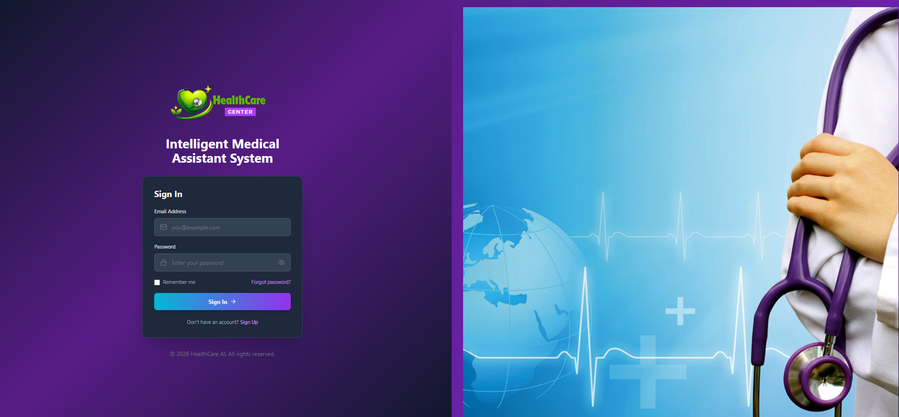
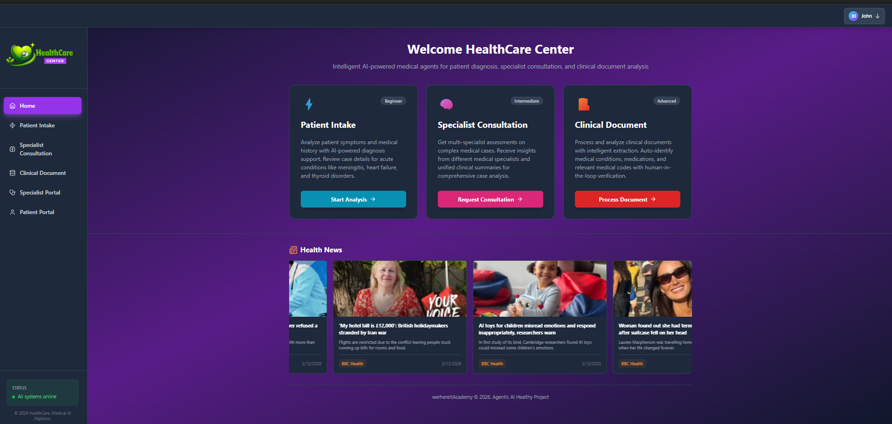
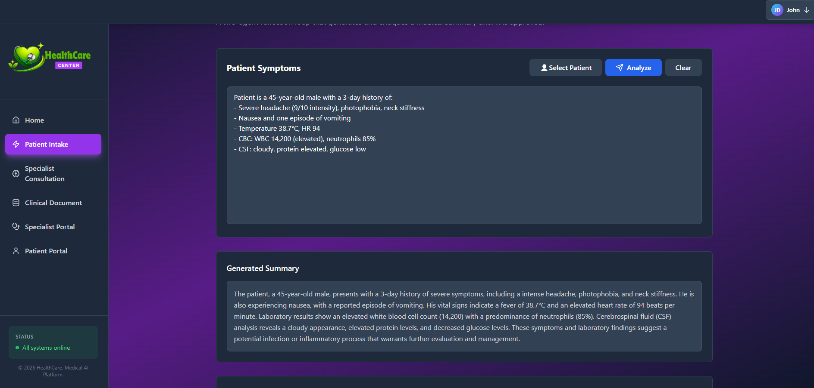
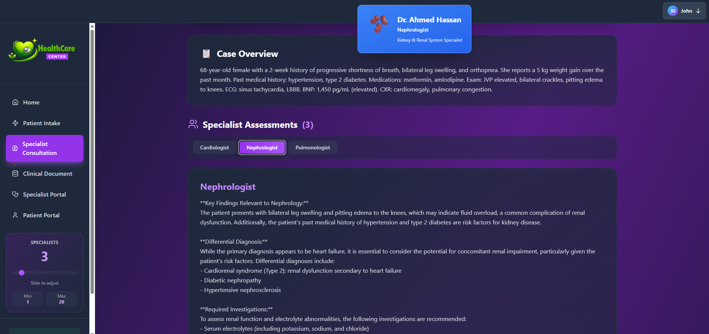
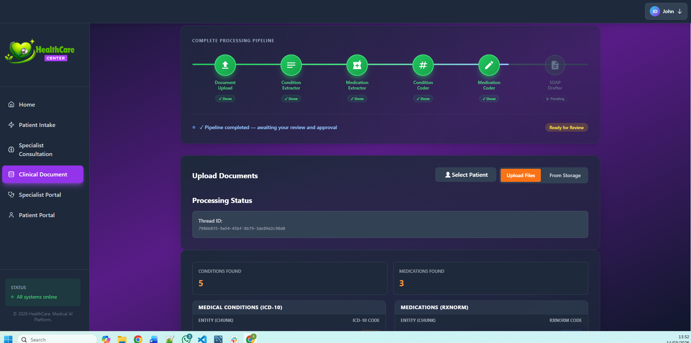
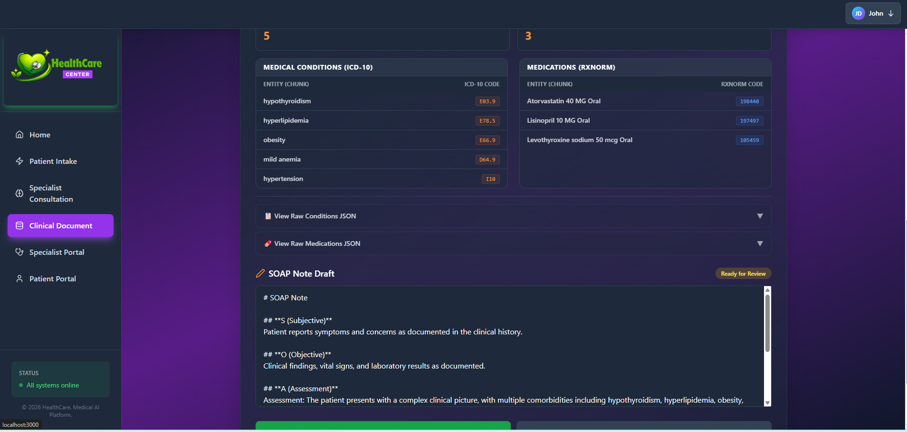
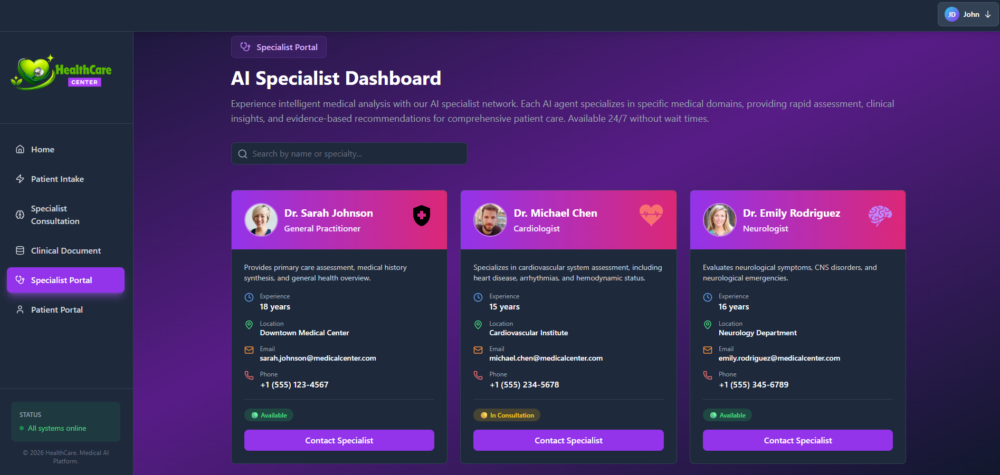
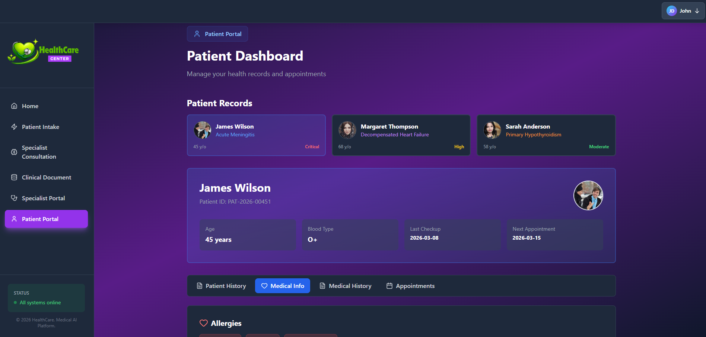
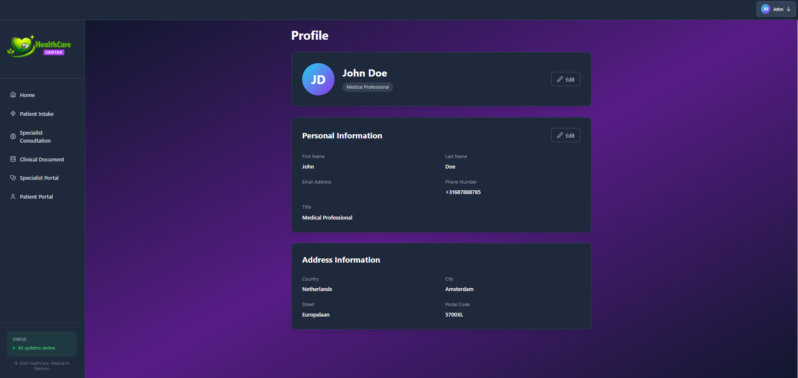

# Healthcare Agentic AI — v2.0

A unified healthcare AI platform featuring three specialized medical agents integrated into a single FastAPI backend and React frontend. This system demonstrates advanced agentic AI concepts through practical healthcare use cases.

**Version:** 2.0 (Reorganized)  
**Status:** Production Ready  

---

## System Overview

### Architecture
```
┌─────────────────────────────────────────────┐
│         React Frontend (general_ui/)         │
│  Patient Intake | Specialist Consultation   │
│    Clinical Document Processing              │
└──────────────────┬──────────────────────────┘
                   │ HTTP/REST
                   ▼
┌─────────────────────────────────────────────┐
│   Unified FastAPI Backend (general_api/)     │
│  • Patient Intake Agent (Reflection Loop)   │
│  • Specialist Consultation Agent (Parallel) │
│  • Clinical Document Agent (Pipeline+HiL)  │
└─────────────────────────────────────────────┘
```

---

### Project Focus & Scope

> **This project prioritizes mastering Agentic AI working principles over production infrastructure.**
> 
> The focus is on **agent design patterns** (reflection loops, parallel fan-out, human-in-the-loop)
> and **LLM integration** rather than enterprise-grade features. Therefore, database connections 
> and persistent server infrastructure are intentionally omitted. This allows you to concentrate 
> on the core concepts: state management, conditional routing, multi-agent coordination, and 
> human approval workflows—without the distraction of database schemas, migrations, or deployment 
> complexity. Once you master these agentic patterns, scaling to production with databases, 
> authentication, and microservices becomes straightforward.

---

## What You Will Learn

### Agentic AI Concepts
- **Reflection Loops**: Generator and Critic nodes that iteratively improve output (Patient Intake Agent)
- **Supervisor + Parallel Fan-Out**: LLM-driven routing and concurrent specialist analysis (Specialist Consultancy Agent)
- **Sequential Pipelines with Human-in-the-Loop**: Multi-phase workflows with interrupt checkpoints for human review (Clinical Document Agent)
- **State Management**: How state flows through multi-node graphs and how to use operators to accumulate results
- **Conditional Routing**: Dynamic decision-making at runtime based on LLM output

### Core Technologies
- **LangGraph**: Building stateful multi-agent graphs with complex control flow
- **FastAPI**: Unified backend API serving multiple agents
- **React + TypeScript**: Modern frontend with centralized API configuration
- **LiteLLM**: Provider-agnostic LLM access (OpenAI, Claude, local models, etc.)
- **Pydantic**: Robust structured output validation from LLMs

### Healthcare Domain Knowledge
- **ICD-10-CM Coding**: How medical conditions are standardized and coded
- **RxNorm (RxCUI)**: Medication standardization and drug coding
- **SOAP Notes**: Clinical documentation structure (Subjective, Objective, Assessment, Plan)
- **Clinical Workflow**: Why human review gates are essential for safety and accuracy

---

## The Three Agents

### 1. **Patient Intake Agent** (Basic)
**Pattern:** Reflection Loop (Generator → Critic)

Entry point for patient symptoms.  

**Flow:**
1. **Generator Node**: Takes patient symptom description, drafts a medical summary
2. **Critic Node**: Reviews the draft for:
   - No explicit diagnoses (only differential considerations)
   - Professional clinical tone
   - No hallucinated facts
3. **Loop**: If rejected, Generator refines based on Critic feedback (max 5 iterations)
4. **Output**: Approved summary with revision history

**API Endpoint:** `POST /basic/analyze`
```json
{
  "text": "Patient presents with chest pain and shortness of breath..."
}
```

---

### 2. **Specialist Consultancy Agent** (Intermediate)
**Pattern:** Supervisor + Parallel Fan-Out + Aggregator

Medical case routed to multiple specialists simultaneously.

**Flow:**
1. **Supervisor Node**: LLM reads case, selects top_k relevant specialists from pool of 20
2. **Parallel Specialist Nodes**: All selected specialists analyze the case simultaneously via `Send` API
3. **Aggregator Node**: Synthesizes all assessments into:
   - Consensus findings
   - Areas of divergence
   - Prioritized management plan

**API Endpoint:** `POST /intermediate/analyze`
```json
{
  "case": "56-year-old patient with elevated troponin...",
  "top_k": 5
}
```

**Specialist Pool:** Cardiologist, Neurologist, Pulmonologist, Gastroenterologist, Rheumatologist, etc.

---

### 3. **Clinical Document Agent** (Advanced)
**Pattern:** Sequential Pipeline + Human-in-the-Loop

Multi-phase document processing with human approval gate.

**Flow:**
1. **Condition Extractor**: Extracts conditions from clinical documents
2. **Medication Extractor**: Extracts medications with dosage and route
3. **Condition Coder**: Assigns ICD-10-CM codes
4. **Medication Coder**: Assigns RxNorm codes
5. **SOAP Drafter**: Generates draft SOAP note
6. **Human Review Gate**: Workflow pauses; clinician reviews and edits SOAP note in UI
7. **Finalization**: After approval, final signed SOAP note is created

**API Endpoints:**
- `POST /advanced/upload` - Upload and process documents
- `POST /advanced/approve` - Approve SOAP note after human review
- `GET /advanced/files` - List available documents

---

## Project Repository Structure

```
HealthCare_agentic_ai/
├── general_api/                          # Unified FastAPI backend
│   ├── main.py                           # FastAPI server with all three agents
│   ├── patient_intake_agent.py           # Basic Agent
│   ├── specialist_consultancy_agent.py   # Intermediate Agent
│   ├── medical_document_agent.py         # Advanced Agent
│   ├── tools.py                          # Shared utilities and tools
│   ├── requirements.txt                  # Python dependencies
│   ├── data/                             # Document storage
│   └── .env                              # Environment configuration
│
├── general_ui/                           # React + TypeScript frontend
│   ├── src/
│   │   ├── pages/
│   │   │   ├── PatientIntakePage.tsx     # Basic Agent UI
│   │   │   ├── SpecialistConsultationPage.tsx  # Intermediate Agent UI
│   │   │   ├── ClinicalDocumentPage.tsx        # Advanced Agent UI
│   │   │   ├── HomePage.tsx              # Landing page
│   │   │   └── ...
│   │   ├── components/                   # Shared UI components
│   │   ├── config/
│   │   │   └── api.ts                    # Centralized API configuration
│   │   └── App.tsx                       # Main routing
│   ├── package.json
│   ├── tailwind.config.js
│   └── .env.local                        # Frontend environment
│
├── Archive/                              # Previous single-project implementations
│   ├── 01_basic_agent/
│   ├── 02_intermediate_agent/
│   └── 03_advanced_agent/
│
├── REORGANIZATION.md                     # Detailed v2.0 migration guide
└── README.md                             # This file
```

---

## Quick Start

### Prerequisites
- Python 3.10+
- Node.js 16+
- pip and npm
- LLM API keys (OpenAI, Anthropic, or compatible)

### Backend Setup

```bash
# Navigate to backend
cd general_api

# Create and activate virtual environment
python -m venv venv
venv\Scripts\activate  # Windows
# source venv/bin/activate  # Linux/Mac

# Install dependencies
pip install -r requirements.txt

# Configure environment variables
copy .env.example .env
# Edit .env with your LLM API keys and model preferences

# Start API server
python main.py
# API will be available at http://localhost:8001
```

### Frontend Setup

```bash
# Navigate to frontend
cd general_ui

# Install dependencies
npm install

# Configure API endpoint
echo "REACT_APP_API_URL=http://localhost:8001" > .env.local

# Start development server
npm start
# UI will open at http://localhost:3000
```

### Verify Setup

- **API Health:** `curl http://localhost:8001/health`
- **API Docs:** Open http://localhost:8001/docs in browser
- **Frontend:** Open http://localhost:3000 in browser

---

### Demo Login Credentials

For testing the frontend, the following demo credentials are available:

#### Login Portal
- **Username:** `patient@example.com`
- **Password:** `patient123`

`

> **Note:** These is demo credential for development and testing only. 
---

## API Reference Summary

### Health Checks
```
GET /health                    # Global health
GET /basic/health             # Patient Intake Agent health
GET /intermediate/health      # Specialist Consultancy health
GET /advanced/health          # Clinical Document Agent health
```

### Patient Intake Agent (Basic)
```
POST /basic/analyze
Body: { "text": "patient symptoms..." }
Response: { "final_summary": "...", "history": [...] }
```

### Specialist Consultancy Agent (Intermediate)
```
POST /intermediate/analyze
Body: { "case": "medical case...", "top_k": 5 }
Response: {
  "case_summary": "...",
  "specialist_assessments": [...],
  "unified_summary": "...",
  "specialists_count": 5
}
```

### Clinical Document Agent (Advanced)
```
GET /advanced/files                                # List documents
POST /advanced/upload                              # Upload and process
POST /advanced/process-storage                     # Process from storage
POST /advanced/approve                             # Approve SOAP note
Body (approve): { "thread_id": "...", "updated_soap": "..." }
```

For complete details, visit `http://localhost:8001/docs` (Swagger UI).

---

## Key Features

### 1. Unified API Gateway
- Single FastAPI server serves all three agents
- Consistent error handling and response formats
- Built-in async/await for concurrent requests
- Swagger documentation auto-generated

### 2. Centralized Frontend Configuration
- All API endpoints defined in one place (`src/config/api.ts`)
- No hardcoded URLs scattered across components
- Easy to switch between development/production

### 3. Agent Isolation with Shared Infrastructure
- Each agent maintains independent logic
- Common tools and utilities in `tools.py`
- Shared LLM configuration via environment variables
- Clean separation of concerns

### 4. Human-in-the-Loop for Advanced Agent
- Workflow pauses at checkpoint for human review
- Clinician can edit intermediate results
- Edited content preserved in final output
- Audit trail of approvals and changes

---

## Development Workflow

### Running Complete System

```bash
# Terminal 1 - Backend
cd general_api
source venv/bin/activate  # or: venv\Scripts\activate on Windows
python main.py

# Terminal 2 - Frontend
cd general_ui
npm start
```

### Making Changes

**Backend:**
```bash
# Edit agent code in general_api/
# Restart API: Ctrl+C and python main.py again
# Check logs in terminal
# API docs auto-update at /docs
```

**Frontend:**
```bash
# Edit React components
# Hot-reload automatically applies changes
# Check console in browser DevTools (F12)
```

### Debugging

- **Backend Logs:** Check terminal running `python main.py`
- **API Docs:** Visit `http://localhost:8001/docs`
- **Browser Console:** Open DevTools (F12) → Console tab
- **Network Monitoring:** DevTools → Network tab to see API calls

---

## Environment Variables

### Backend (.env in general_api/)
```bash
# LLM Configuration
LLM_MODEL=gpt-4  # or claude-3-sonnet, etc.
OPENAI_API_KEY=sk-...
ANTHROPIC_API_KEY=sk-ant-...

# Server Configuration
API_HOST=0.0.0.0
API_PORT=8001
DEBUG=false

# Data Storage
DATA_DIR=/app/data
```

### Frontend (.env.local in general_ui/)
```bash
REACT_APP_API_URL=http://localhost:8001
```

---

## Common Issues & Troubleshooting

| Issue | Cause | Solution |
|---|---|---|
| `Connection refused on port 8001` | Backend not running | Start backend: `cd general_api && python main.py` |
| `CORS error in browser` | Backend CORS not configured | Ensure `fastapi.middleware.cors.CORSMiddleware` is added in main.py |
| `ModuleNotFoundError` | Missing Python dependencies | `cd general_api && pip install -r requirements.txt` |
| `API returns 401/403` | LLM API key invalid or expired | Check `.env` file, verify API key with provider |
| `Frontend shows loading spinner forever` | API unreachable or slow | Check browser Network tab, verify `REACT_APP_API_URL` |
| `SOAP note doesn't pause for approval` | Missing `interrupt_after` in graph | Verify graph compilation includes `interrupt_after=["saga_drafter"]` |

---

## Architecture Decisions

### Why Unified API?
- **Simplicity:** Single endpoint for all agent functionality
- **Scalability:** Easier to add more agents or features
- **Maintenance:** Centralized configuration and logging
- **Consistency:** Same error handling and response format

### Why React + TypeScript?
- **Type Safety:** Catch errors at compile time
- **Developer Experience:** IntelliSense and refactoring support
- **Component Reusability:** Shared Navbar, Sidebar, Footer components
- **Modern Tooling:** Hot-reload, testing frameworks, bundle optimization

### Why LangGraph?
- **State Management:** Explicit state handling for complex workflows
- **Interrupts:** Built-in human-in-the-loop support
- **Composition:** Easy to combine agents into larger systems
- **Testing:** Deterministic playback and inspection


---

## Learning Outcomes

After working through this system, you will understand:

1. **How to design stateful multi-agent workflows** using LangGraph
2. **How to build a production-grade API** with FastAPI
3. **How to create a modern frontend** with React and TypeScript
4. **How to safely integrate LLMs** into healthcare workflows
5. **How to implement human-in-the-loop** approval processes
6. **How to handle parallel execution** with `Send` API
7. **How to structure code** for maintainability and testing

---

## Next Steps

### For Learning
1. Read through each agent implementation in `general_api/`
2. Trace the data flow from API endpoint to LLM to frontend
3. Modify prompts in agents and observe output changes
4. Add new specialists to the Specialist Consultancy Agent
5. Implement new coding systems (beyond ICD-10 and RxNorm)

### For Production
1. Add database for persistent storage
2. Implement user authentication and authorization
3. Set up monitoring, logging, and alerting
4. Add rate limiting and request validation
5. Containerize with Docker and deploy to cloud
6. Set up CI/CD pipeline

---

## Features & Screenshots

### 1. **Login Page**
The entry point for the application with role-based authentication.

**Features:**
- Email and password authentication
- Remember me functionality with secure localStorage
- Password visibility toggle
- Demo credentials for testing
- Responsive design for mobile and desktop



**How to Use:**
1. Enter email and password from demo credentials section (above)
2. Click "Sign In"
3. You'll be redirected to Home page
4. Remember me checkbox stores credentials for future logins

---

### 2. **Home Page**
Dashboard showcasing all three AI agents and quick navigation to their features.

**Features:**
- Quick access cards for three agents (Basic, Intermediate, Advanced)
- Agent descriptions and capabilities overview
- Health News feed section with latest medical news
- Role-based sidebar navigation
- System status indicator at bottom left
- User profile in top right corner



**What You Can Do:**
- Browse all available medical AI agents
- View detailed agent descriptions
- Navigate directly to Patient Intake, Specialist Consultation, or Clinical Document processing
- Check latest health news and medical updates

---

### 3. **Patient Intake Agent** (Basic Level)
Analyze patient symptoms and generate professional medical summaries using AI-powered reflection loops.

**Features:**
- Text input area for patient symptoms and medical history
- Real-time AI analysis with Generator-Critic loop
- Iterative improvement of medical summaries (max 5 iterations)
- "How It Works" tutorial snackbar on first visit
- Review of full revision history
- Professional clinical tone validation
- Safety checks preventing explicit diagnosis statements



**Workflow:**
1. **Input:** Enter patient symptoms, vital signs, and medical history
2. **Generate:** AI creates initial summary
3. **Critique:** AI Critic reviews for accuracy, safety, and professionalism
4. **Loop:** If rejected, Generator refines based on feedback
5. **Approve:** Once approved, summary shown with full history

**Example Input:**
```
Patient is a 45-year-old male with a 3-day history of:
- Severe headache (9/10 intensity), photophobia, neck stiffness
- Nausea and one episode of vomiting
- Temperature 38.7°C, HR 94
```

**AI Output:**
Professional summary focusing on differential diagnoses without explicit diagnosis.

---

### 4. **Specialist Consultation Agent** (Intermediate Level)
Get insights from multiple AI specialists analyzing complex medical cases simultaneously.

**Features:**
- Complex case input for multi-specialist analysis
- **Adjustable specialist count** (1-20) via sidebar slider
- Parallel AI specialist processing for fast results
- **Specialist Assessment Tabs** showing individual specialist opinions
- Unified clinical summary synthesizing all assessments
- Key findings, differential diagnoses, and management plans from each specialist



**Available Specialists (20+):**
Cardiologist, Neurologist, Pulmonologist, Gastroenterologist, Rheumatologist, Endocrinologist, Nephrology, Infectious Disease, Hematology, Oncology, and more...

**Workflow:**
1. **Input:** Enter complex medical case
2. **Supervisor:** AI selects relevant specialists based on case
3. **Parallel Analysis:** All selected specialists analyze simultaneously
4. **Synthesis:** AI synthesizes consensus, divergence, and disagreements
5. **Output:** Unified recommendations and management plan

**Example Case:**
"68-year-old female with progressive shortness of breath, bilateral leg swelling..."
- **Cardiologist:** Reviews heart failure indicators
- **Nephrologist:** Assesses kidney involvement and fluid overload
- **Pulmonologist:** Evaluates lung congestion and respiratory function
- **Unified Plan:** Combined differential diagnoses and treatment approach

---

### 5. **Clinical Document Processing Agent** (Advanced Level)
Process clinical documents with intelligent extraction, medical coding, and human-in-the-loop approval.

**Features:**
- **Multi-format Support:** Upload PDF, TXT, or CSV documents
- **Intelligent Extraction:** Automatically extracts conditions and medications
- **Medical Coding:** 
  - ICD-10-CM codes for conditions
  - RxNorm codes for medications
- **SOAP Generation:** Automatic structured clinical note creation
- **Visual Pipeline:** Real-time progress visualization of 5 processing stages
- **Human Review Gate:** Built-in approval workflow for clinician verification
- **Editable Output:** Modify extracted information before finalization



**Processing Pipeline (5 Stages):**

1. **📄 Document Upload** - Accept and validate documents
2. **🏥 Condition Extractor** - Identify medical conditions (e.g., "hypothyroidism")
3. **💊 Medication Extractor** - Extract drugs with dosage and route
4. **#️⃣ Condition Coder** - Assign ICD-10-CM codes (e.g., E03.9)
5. **#️⃣ Medication Coder** - Assign RxNorm codes (e.g., RxCUI: 196448)
6. **✏️ SOAP Drafter** - Generate structured clinical note
7. **👁️ Human Review** - Clinician reviews and approves


**Output Information:**

**Medical Conditions (ICD-10):**
| Condition | ICD-10 Code | Status |
|-----------|------------|--------|
| Hypothyroidism | E03.9 | ✓ Done |
| Hyperlipidemia | E78.5 | ✓ Done |
| Obesity | E66.9 | ✓ Done |

**Medications (RxNorm):**
| Medication | Dosage | Route | RxNorm Code |
|-----------|--------|-------|------------|
| Atorvastatin | 40 MG | Oral | 196448 |
| Lisinopril | 10 MG | Oral | 197497 |
| Levothyroxine | 50 mcg | Oral | 185499 |

**SOAP Note Structure:**
```
## SOAP Note

### S (Subjective)
Patient-reported symptoms and concerns...

### O (Objective)  
Clinical findings, vital signs, and laboratory results...

### A (Assessment)
Clinical impression with multiple comorbidities...

### P (Plan)
Treatment recommendations and follow-up schedule...
```



**How to Use:**
1. Click "Upload Files" button
2. Select documents (PDF, TXT, or CSV)
3. System processes through 5 stages
4. Review extracted conditions and medications
5. Review SOAP note draft
6. Edit if needed
7. Click "Approve SOAP Note"
8. Final note is ready for medical records

---

### 6. **Specialist Portal**
Browse and connect with AI specialist agents available in the system.

**Features:**
- Interactive specialist directory
- Specialist cards with:
  - Profile photo
  - Name and specialty
  - Years of experience
  - Medical institution location
  - Email and phone contact
  - Current availability status
- Search functionality to find specialists
- Filter by specialty
- Real-time availability indicators:
  - 🟢 **Available** - Ready for consultation
  - 🟡 **In Consultation** - Currently busy
  - Status shows time and specialization



**Use Case:**
- Find specific specialist for second opinion
- Check availability before scheduling
- View expertise and experience
- Contact specialist directly

---

### 7. **Patient Portal**
Manage personal health records and medical history.

**Features:**
- **Patient Dashboard** with overview
- **Multiple Patient Records:**
  - Quick access cards for different patients
  - Risk level indicators (Critical 🔴, High 🟠, Moderate 🟢)
  - Age, condition, and status info
- **Detailed Patient Information:**
  - Full patient demographics
  - Age, blood type, vital info
  - Last checkup and next appointment dates
- **Medical Records Tabs:**
  - Patient History - Full history record
  - Medical Info - Current medications and allergies
  - Medical History - Past diagnoses and treatments
  - Appointments - Scheduled follow-ups
- **Health Conditions Tracking:**
  - Allergies and sensitivities
  - Current conditions
  - Medications and dosages



**Workflow:**
1. View all patients in system
2. Select patient to view details
3. Review medical history and conditions
4. Check appointments and follow-ups
5. View allergies and important health notes

---

### 8. **Profile Page**
Manage your personal account information and user profile details.

**Features:**
- User profile overview with avatar
- **Personal Information:**
  - First Name and Last Name
  - Email Address
  - Phone Number
  - Title/Role (Medical Professional, etc.)
- **Address Information:**
  - Country
  - City
  - Street Address
  - Postal Code
- Edit button for updating profile information
- Role-based access with admin edit functionality



**How to Use:**
1. Click on user avatar in top right corner
2. Select "Profile" from menu
3. View your personal and address information
4. Click "Edit" button to modify information
5. Update details and save changes
6. Changes are immediately reflected in your profile

**Information Displayed:**
- Current logged-in user details
- Contact information (Email, Phone)
- Professional role/title
- Location information
- User avatar/profile picture

---

## System Status Indicators

The application displays real-time status information:

**Frontend Status:**
- ✅ Active at http://localhost:3000
- Real-time user authentication
- Responsive UI across devices

**Backend API Status:**
- ✅ Active at http://localhost:8001
- All three agents operational
- Health endpoints monitoring all services

**Displayed in UI:**
- 🟢 Green indicator: "All systems online"
- Shows "AI system online" badge
- Real-time availability updates

---

## Workflow Examples

### Example 1: Patient Presenting with Chest Pain
**Using: Patient Intake Agent (Basic)**

```
INPUT:
Patient is a 45-year-old male with 3-day history:
- Severe chest pain (7/10)
- Shortness of breath on exertion
- Mild diaphoresis
- BP: 145/90, HR: 98

PROCESS:
Generator → Creates draft summary
    ↓ (Sent for criticism)
Critic → Reviews for accuracy and safety
    ↓ (If rejected, feedback sent back)
Generator → Refines based on feedback
    ↓ (Repeats max 5 times until approved)

OUTPUT:
"45-year-old patient presents with acute chest pain characterized by...
Vital signs show mild hypertension and tachycardia. Differential 
considerations include acute coronary syndrome, pulmonary embolism,
aortic dissection, and musculoskeletal causes. Immediate EKG and 
troponin levels recommended..."

Revision History: 2 iterations before approval
```

### Example 2: Complex Case Requiring Multiple Specialists
**Using: Specialist Consultancy Agent (Intermediate)**

```
INPUT:
68-year-old female with:
- Progressive SOB for 2 weeks
- Bilateral leg swelling
- Elevated troponin (6.5)
- Hypertension, diabetes, On metformin, amlodipine
- Exam: JVP elevated, bilateral crackles, pitting edema to knees
- ECG: Sinus tachycardia, LBBB

SPECIALISTS SELECTED (top 5):
1. Cardiologist - Heart failure specialist
2. Nephrologist - Kidney/fluid specialist
3. Pulmonologist - Lung congestion expert
4. Endocrinologist - Diabetes complications
5. Internist - Overall coordination

PARALLEL ANALYSIS:
- Cardiologist: "Consistent with acute decompensated heart failure"
- Nephrologist: "Acute kidney injury complicating cardiac failure"
- Pulmonologist: "Bilateral pulmonary edema secondary to heart failure"
- Endocrinologist: "Diabetes contributing to vascular complications"

UNIFIED OUTPUT:
"Primary diagnosis: Acute decompensated heart failure with secondary
AKI and pulmonary edema. Underlying causes: long-standing hypertension,
diabetes, and possible myocardial infarction. Recommended: ICU admission,
diuretics, ACE inhibitors, cardiology consult, nephrology follow-up..."
```

### Example 3: Clinical Document Processing with Human Review
**Using: Clinical Document Agent (Advanced)**

```
INPUT DOCUMENT:
Clinical note PDF with patient information, symptoms, exam findings,
lab results

AUTOMATED PIPELINE:
1. Document Upload ✓
2. Condition Extraction ✓
   Found: hypothyroidism, hyperlipidemia, hypertension, anemia
3. Medication Extraction ✓
   Found: Levothyroxine 50mcg daily, Atorvastatin 40mg daily, Lisinopril 10mg daily
4. Condition Coding ✓
   E03.9, E78.5, I10, D50.9
5. Medication Coding ✓
   RxCUI: 185499, 196448, 197497
6. SOAP Drafting ✓
   Complete structured note generated
7. Human Review ⏳ AWAITING APPROVAL

CLINICIAN REVIEW GATE:
- Reviews SOAP draft
- Edits "Assessment" section to add clinical impression
- Confirms ICD-10 codes are accurate
- Changes one medication dosage
- Clicks "Approve SOAP Note"

FINALIZATION:
✓ SOAP note saved to medical records
✓ Ready for filing and insurance claims
```

---

**Last Updated:** March 2026


